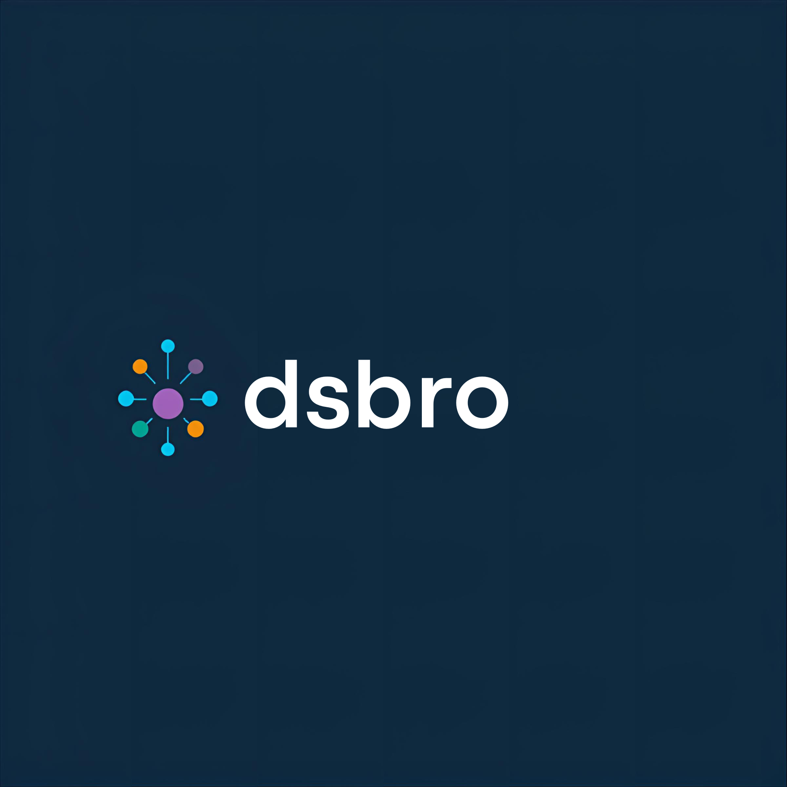

<p align="center">
  
</p>

# dsbro

[](https://www.python.org/)
[](LICENSE)
[](https://github.com/muhammadibrahim313/dsbro)

Your Data Science Bro. One import away.

`dsbro` is a lightweight Python toolkit for notebook-heavy data science work. It is built for the
repeated workflow most people have in Kaggle, Colab, and local Jupyter notebooks: setup, load
data, inspect it, clean it, visualize it, and train a baseline model fast.

## What dsbro covers

- `dsbro.utils`: notebook setup, seeding, timers, system info, downloads, simple parallel work
- `dsbro.io`: file loading, saving, previews, directory trees, file search, submission helpers
- `dsbro.eda`: overview tables, missing-value analysis, drift checks, target analysis, comparisons
- `dsbro.prep`: encoding, scaling, missing-value filling, feature engineering, memory reduction
- `dsbro.viz`: themed matplotlib and optional plotly charts for fast notebook visuals
- `dsbro.metrics`: classification and regression metrics in one place
- `dsbro.ml`: model comparison, cross-validation, training, tuning, stacking, pseudo-labeling
- `dsbro.text`: text cleaning, tokenization, word frequencies, and TF-IDF features

## Current status

Implemented now:

- Core package scaffold and packaging
- `utils`, `io`, `eda`, `prep`, `viz`, `metrics`, `ml`, and `text`
- Built-in help and about/version entry points
- Tests across the implemented modules
- Quickstart notebook in [examples/quickstart.ipynb](examples/quickstart.ipynb)

Still planned:

- Final polish for docs/examples
- Additional ML/deep-learning extras over time

## Installation

For local development:

```bash
pip install -e ".[dev]"
```

Optional extras:

```bash
pip install -e ".[ml]"
pip install -e ".[plotly]"
pip install -e ".[all]"
```

PyPI packaging is scaffolded, but this repository is still in active buildout.

## Quick example

```python
import dsbro
import pandas as pd

dsbro.setup()

train = pd.DataFrame(
    {
        "age": [22, 35, 41, 28],
        "city": ["lahore", "karachi", "lahore", "islamabad"],
        "purchased": [0, 1, 1, 0],
    }
)

overview = dsbro.eda.overview(train)
processed, report = dsbro.prep.auto_preprocess(train, target="purchased")
leaderboard = dsbro.ml.compare(train, target="purchased", cv=2)
```

## Help system

`dsbro` includes a built-in cheatsheet:

```python
dsbro.help()
dsbro.help("viz")
dsbro.help("encode")
dsbro.about()
dsbro.version()
```

## Notebook example

The repository includes a walkthrough notebook:

- [examples/quickstart.ipynb](examples/quickstart.ipynb)

It demonstrates:

- `dsbro.setup()`
- `dsbro.eda.overview()`
- `dsbro.prep.datetime_features()`
- `dsbro.prep.text_features()`
- `dsbro.prep.auto_preprocess()`
- `dsbro.viz.bar()`
- `dsbro.ml.compare()`

## Development

```bash
pytest tests/ -v
ruff check dsbro/ tests/
ruff format dsbro/ tests/
python -m build
```

## Roadmap

- Expand example notebooks
- Add GitHub Actions CI
- Publish to TestPyPI, then PyPI
- Continue polishing module docs and tutorial coverage

## License

MIT. See [LICENSE](LICENSE).
